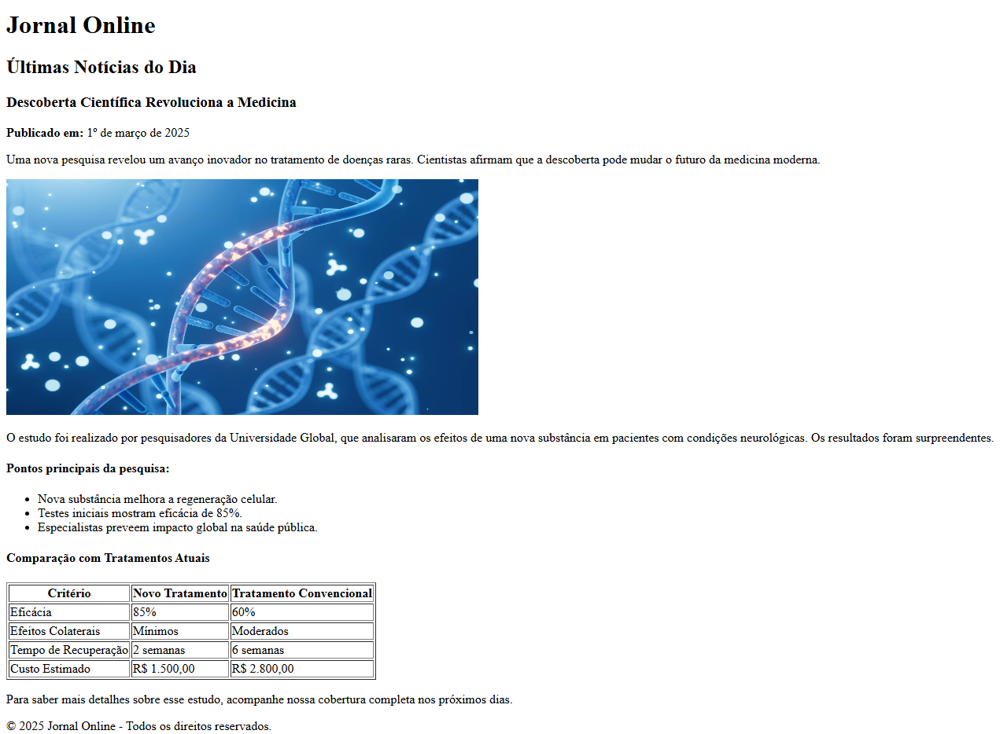

# Atividade 01 de Autoria Web - Prof Jose Neto - UNIFIP

## Requisitos
Crie uma página html (pagina.html) que seja semelhante a imagem abaixo, utilizando os conceitos encontrados na Aula 02. Você pode utilizar qualquer editor/IDE, como o VSCode, notepad++, SublimeText etc...

## Imagem Exemplo:

## Referências

- [Documentação Oficial do HTML](https://developer.mozilla.org/pt-BR/docs/Web/HTML) - Mozilla Developer Network (MDN)
- [Guia de HTML5](https://www.w3schools.com/html/) - W3Schools  
- [Unifip Tech](https://unifip.tech/) - Autoria Web (Unifip) - Prof. José Neto
